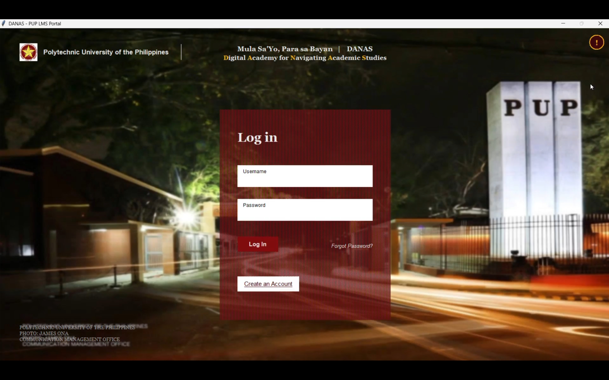

# DANAS - Digital Academy for Navigating Academic Skills and Success

A Python-based desktop Learning Management System (LMS) designed to help instructors manage academic content and allow students to access and enroll in courses.

The application uses Object-Oriented Programming principles and Tkinter for the graphical user interface.

---

## Features

### Student Features
- Student login system
- Browse available courses
- Enroll in classes
- Access learning materials

### Faculty Features
- Faculty login system
- Upload and manage course content
- Manage academic resources

### System Features
- Graphical user interface using Tkinter
- Database-driven storage
- Organized backend architecture
- User authentication system

---

## Technologies Used

- Python
- Tkinter
- SQLite Database
- Object-Oriented Programming (OOP)
- File Handling

---

## Project Structure

```text
python-lms-desktop-app/
├── Assets/
│   └── Application images and resources
│
├── Backend/
│   ├── course_manager.py
│   └── material_manager.py
│
├── Database/
│   ├── database1.py
│   └── student_engine.py
│
├── Login.py
├── Student.py
├── Faculty.py
├── danas.db
└── README.md
```
## Screenshots

### Login Screen


### Faculty Dashboard


### Student Dashboard

